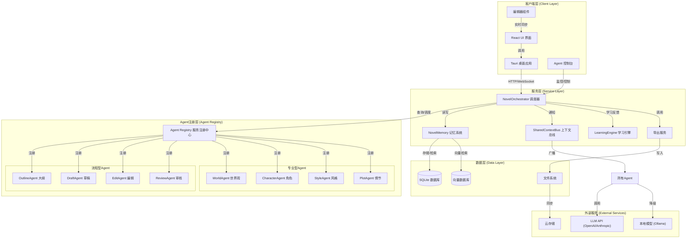
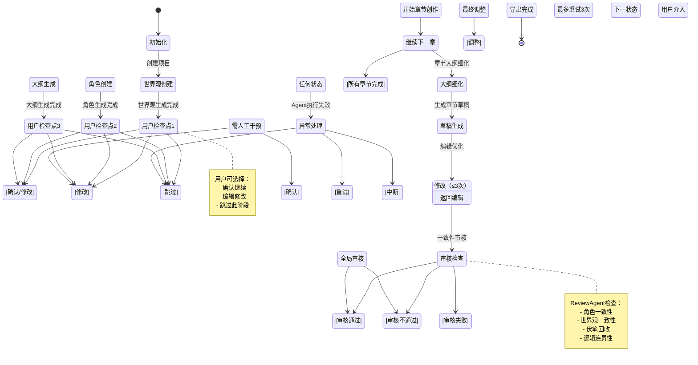

# 小说创作Agent系统设计文档评审报告

## 评审信息

**评审版本：** v1.0  
**评审日期：** 2026-06-07

---

## 一、评审总览

### 1.1 评审综述
本报告对《小说创作Agent系统设计方案》（v1.0）进行全面评审。该方案提出了一个基于 Tauri + React + FastAPI 的多Agent协作小说创作系统，包含8个专业Agent、三层记忆架构、学习与优化系统等核心模块。整体设计思路清晰，参考了 Hermes Agent、Claude Code、Sudowrite 等优秀项目的设计理念，具备较好的工程化基础。

**评审综合评分：**

| 评审维度 | 评分 | 说明 |
|---------|------|------|
| 架构设计 | 8.5/10 | 分层清晰，Agent分工合理，但缺少服务注册与发现机制 |
| 技术可行性 | 7.5/10 | 方案基本可行，但多处技术细节需补充 |
| 工程化成熟度 | 7.0/10 | 缺少测试策略、CI/CD、日志、监控等工程化设计 |
| 数据模型 | 8.0/10 | 实体设计完整，SQL表结构合理，少量字段需调整 |
| 实施路线图 | 7.0/10 | 阶段划分合理，但缺少交付物定义和验收标准 |
| 文档质量 | 8.0/10 | 结构完整、代码示例丰富，但缺少图表和序列图 |

### 1.2 设计亮点
1. **流程型 + 角色型混合Agent架构**：将创作流程分工（OutlineAgent、DraftAgent、EditAgent、ReviewAgent）与专业领域分工（WorldAgent、CharacterAgent、StyleAgent、PlotAgent）结合，职责边界清晰，易于独立演进和测试。
2. **三层记忆架构**：工作记忆→短期记忆→长期记忆的分层设计，配合摘要链和向量检索，是解决长文本创作上下文遗忘问题的合理方案。
3. **人机协作协议**：CollaborationProtocol 设计支持全自动/半自动/手动三种模式，通过检查点机制实现灵活的用户介入，这是实际产品中非常重要的设计。
4. **去AI味多层次方案**：负面样本学习 + 风格迁移 + 后处理规则的组合拳，比单纯依赖Prompt更可靠。
5. **状态机驱动的调度器**：NovelOrchestrator 采用明确的状态转换，流程可追溯、可恢复，便于调试和故障排查。

### 1.3 核心问题汇总

| # | 问题类别 | 严重级别 | 简要描述 |
|---|---------|---------|---------|
| 1 | 架构设计 | 高 | 缺少服务注册与发现机制，Agent间硬编码依赖强 |
| 2 | 技术实现 | 高 | ContextAssembler 的 8000 token 限制偏低，未适配主流长上下文模型 |
| 3 | 技术实现 | 高 | 学习系统依赖“强化学习奖励模型”但缺少具体实现路径 |
| 4 | 工程化 | 中 | 缺少测试策略、日志架构、监控告警、CI/CD设计 |
| 5 | 数据模型 | 中 | Chapter表缺少version字段，无法支撑版本分支功能 |
| 6 | 安全性 | 中 | Tauri-Python通信缺少认证、加密和资源访问控制 |
| 7 | 实施计划 | 中 | 路线图缺少交付物定义、验收标准和里程碑节点 |
| 8 | 性能 | 低 | 缺少并发控制、流式生成的具体实现方案 |

---

## 二、架构设计评审

### 2.1 整体架构评价

原文档的架构图采用ASCII文本绘制，虽然能传达层次关系，但在复杂度和可读性上有局限。以下是改进后的系统架构图：

#### 图 1：改进后的系统架构图



### 2.2 建议新增：服务注册与发现机制

原文档中 Orchestrator 直接硬编码初始化所有Agent，这种方式存在以下问题：
1. Agent间依赖硬编码，无法动态替换或禁用某个Agent
2. 难以支持插件化扩展（如用户自定义Agent）
3. 无法在运行时根据任务类型动态选择最优Agent

**建议引入服务注册与发现机制（参考 LangGraph 的 Agent Registry 模式）：**

每个Agent在启动时自我注册，声明其能力（capabilities）、输入输出模式、依赖关系。Orchestrator 通过注册表查找和调度Agent，而非直接引用。这样可以：

1. 支持运行时动态注册/注销Agent
2. 支持多个同类型Agent的负载均衡和备份
3. 支持用户自定义Agent插件

#### Agent 注册接口示例：

```typescript
interface AgentRegistration {
  id: string;
  name: string;
  type: 'workflow' | 'specialist';
  capabilities: string[];
  inputSchema: JSONSchema;
  outputSchema: JSONSchema;
  dependencies: string[];
  version: string;
}
```

### 2.3 建议新增：PlotAgent 的定位调整

当前 PlotAgent 被归类为“角色型Agent”，但其职责（情节设计、冲突构建）更像是流程型职责——它在大纲生成阶段和章节创作阶段都会被调用。建议将 PlotAgent 重新定位为“流程协作型”，并在 OutlineAgent 生成大纲时作为其协作伙伴，在章节创作时为 DraftAgent 提供情节细节。

### 2.4 Agent协作流程改进

原文档的状态机图缺少并行分支和异常处理路径。以下是改进后的完整协作流程：

#### 图 2：改进后的Agent协作流程图（含用户检查点）



**关键改进点：**
1. **增加异常处理分支**：任何Agent执行失败时，可进入“重试/跳过/中断”的分支逻辑，而非仅有“审核不通过→修改”一条路径。
2. **增加用户检查点**：在世界观完成、角色完成、大纲完成、每章完成、全局审核等关键节点设置用户确认点。
3. **增加最大重试次数限制**：防止审核-修改循环无限进行，建议设置最大重试次数为3次，超过后强制转人工处理。

---

## 三、技术方案评审

### 3.1 长文本上下文管理

**问题：** ContextAssembler 的 MAX_CONTEXT_TOKENS 设为 8000，这个值偏低。当前主流模型如 GPT-4o、Claude 3.5、Qwen-Max 的上下文窗口均为 128K，DeepSeek 为 64K。

**建议将其改为动态计算**，根据当前使用模型的实际窗口大小自动调整：
```python
MAX_CONTEXT_TOKENS = model.max_context_tokens * 0.6  # 预留 40% 给生成内容
```

此外，建议在记忆系统中增加“重要性评分”机制，对每个上下文片段标注重要性权重（如“核心情节”“角色变化”“世界规则”等），在窗口不足时优先保留高权重片段。

#### 图 3：三层记忆架构与上下文组装流程

```mermaid
graph LR
    subgraph "输入触发"
        Trigger["创作触发事件"]
    end

    subgraph "三层记忆"
        Working["工作记忆 (Working)
当前章节内容"]
        Short["短期记忆 (Short-term)
最近3章内容"]
        Long["长期记忆 (Long-term)
小说全量信息"]
    end

    subgraph "上下文组装器"
        Importance["重要性评分
(角色变化/核心情节/世界观规则)"]
        TokenCalc["Token预算分配
根据模型动态计算"]
        ContextOut["最终上下文组装"]
    end

    Trigger -->|查询| Working
    Trigger -->|检索| Short
    Trigger -->|摘要链/向量检索| Long

    Working --> Importance
    Short --> Importance
    Long --> Importance

    Importance -->|按权重排序| TokenCalc
    TokenCalc -->|裁剪/选择| ContextOut
    ContextOut -->|发送给| LLM

    note right of Long
        长期记忆包含：
        - 完整角色档案
        - 完整世界观设定
        - 历史伏笔列表
        - 小说全文摘要链
    end note

    note right of TokenCalc
        Token分配优先级：
        1. 世界观规则 (高)
        2. 活跃角色信息 (高)
        3. 前置章节摘要 (中)
        4. 当前章节上下文 (高)
        5. 历史全文 (按需)
    end note
```

### 3.2 去AI味方案评审

**问题：** AIToneRemover 的正则匹配方案存在误杀风险。例如，“然而”“但是”是正常的中文转折词，不能简单地全局匹配和替换。

**建议改进：**
1. **从“全局匹配”改为“频率检测”**：检测转折词在短文本内的使用频率，只有超过阈值时才触发替换。
2. **使用LLM辅助判断**：对于模糊的AI味模式，可以调用较小的模型进行“是否有AI味”的二分类判断，而非纯规则。
3. **增加“段落节奏多样性”指标**：计算段落长度的变异系数（CV），当 CV 低于阈值时提示重写。

### 3.3 学习系统可行性

**问题：** 原文档提到“强化学习奖励模型”和“偏好向量”，但缺少具体的实现路径。在实际产品中，真正的强化学习需要大量数据和训练资源，对于初期版本不现实。

**建议分两阶段实现：**

| 阶段 | 实现方式 | 效果 |
|------|---------|------|
| Phase 1（规则驱动） | 基于用户反馈更新Prompt模板和风格规则库，统计高频修改模式并自动应用 | 能解决 60-70% 的风格不一致问题，开发成本低 |
| Phase 2（模型驱动） | 基于积累的反馈数据训练轻量级奖励模型或进行LoRA微调 | 更精细的风格控制，但需要足够的数据积累 |

### 3.4 Tauri-Python集成方案

原文档的集成方案基本合理，但缺少以下关键细节：
1. **认证与安全**：Tauri和Python之间的HTTP通信应添加API Key或JWT认证，防止本地其他进程意外调用。
2. **端口发现**：不应硬编码 localhost:8000，应使用随机端口 + 文件锁或环境变量传递端口号。
3. **进程守护**：应具体化守护策略（如最大重启次数、重启延迟、健康检查端点）。
4. **流式生成**：WebSocket的流式生成应采用SSE或分块传输，并定义明确的消息协议（如JSON-RPC）。

---

## 四、数据模型评审

### 4.1 建议修改项

| 表名 | 修改内容 | 原因 |
|------|---------|------|
| chapters | 增加 `version` 字段 | 支撑版本分支功能，原文档提到了“版本分支”但数据模型未支撑 |
| chapters | 增加 `parent_chapter_id` | 支撑章节拆分/合并操作 |
| novels | 增加 `collaboration_mode` | 记录当前协作模式（全自动/半自动/手动） |
| agent_executions | 增加 `token_usage`、`error_log` | 用于成本统计和问题排查 |
| 新增表 | `chapter_versions` | 存储章节的历史版本，含 diff 和备注 |
| 新增表 | `agent_configs` | 存储Agent的注册信息和配置，支撑服务注册机制 |

#### 新增表结构：chapter_versions

```sql
CREATE TABLE chapter_versions (
    id TEXT PRIMARY KEY,
    chapter_id TEXT REFERENCES chapters(id) ON DELETE CASCADE,
    version_number INTEGER NOT NULL,
    content TEXT,
    diff TEXT,
    note TEXT,
    created_by TEXT,
    created_at DATETIME DEFAULT CURRENT_TIMESTAMP
);
```

#### 新增表结构：agent_configs

```sql
CREATE TABLE agent_configs (
    id TEXT PRIMARY KEY,
    agent_id TEXT NOT NULL,
    agent_name TEXT NOT NULL,
    agent_type TEXT NOT NULL,
    capabilities TEXT[],
    config JSONB,
    is_enabled BOOLEAN DEFAULT TRUE,
    version TEXT,
    created_at DATETIME DEFAULT CURRENT_TIMESTAMP,
    updated_at DATETIME DEFAULT CURRENT_TIMESTAMP
);
```

---

## 五、工程化评审

原文档在工程化方面存在明显缺失，以下是建议新增的工程化设计：

### 5.1 建议新增的工程化模块

1. **测试策略**：单元测试（Agent级别）+ 集成测试（流程级别）+ 端到端测试（Tauri→FastAPI→LLM）。建议为每个Agent设计标准化的输入/输出 fixture，便于回归测试。

2. **日志架构**：采用结构化日志（JSON格式），记录每次Agent调用的输入、输出、token消耗、耗时、错误信息。支持日志回放和创作过程复盘。

3. **监控与告警**：对Agent执行时间、token消耗、审核通过率等指标进行监控，设置告警阈值。

4. **CI/CD**：至少包含单元测试自动运行、代码质量检查、Tauri打包测试。

### 5.2 建议新增的文档章节

原文档建议新增以下章节：
1. **错误处理与重试策略**：定义Agent执行失败时的分级重试机制、降级策略（如从大模型降级到小模型）、断路器模式。
2. **Prompt管理与版本控制**：每个Agent的Prompt模板应纳入版本管理，支持A/B测试和回滚。
3. **并发控制**：当多个用户同时创作时，如何控制LLM调用的并发度，避免触发速率限制。
4. **离线支持**：是否支持纯本地模型（Ollama）运行，离线时的功能降级策略。

---

## 六、实施路线图评审

原文档的路线图阶段划分基本合理，但存在以下问题：
1. **缺少交付物定义**：每个Phase应明确“做了什么”而非仅仅“做什么”。建议每个Phase结束时有可运行的演示版本。
2. **缺少验收标准**：如“OutlineAgent能生成一个包含3卷、每卷10章的完整大纲”这样的具体指标。
3. **Phase 3工作量估计偏低**：实现全部8个Agent + Orchestrator + 共享上下文总线 + 人机协作协议，2-3周可能不够，建议调整为3-4周。

**改进后的路线图建议：**

| Phase | 周期 | 交付物 | 验收标准 |
|-------|------|-------|---------|
| 1 | 2-3周 | 可运行的框架原型：创建项目、打开编辑器、调用单个Agent | Tauri启动→数据库初始化→Python后端自动启动→能完成一次完整的创作流程 |
| 2 | 3-4周 | 可用的创作工作台：大纲生成 + 章节创作 + 基础记忆系统 | 能完成一篇短篇小说（3-5章）的全流程创作，前后文基本一致 |
| 3 | 3-4周 | 完整的多Agent协作：全部8个Agent + 人机协作 + 审核循环 | 能完成一篇中篇小说（10-20章）的创作，角色和世界观保持一致 |
| 4 | 2-3周 | 学习系统 + 去AI味 + 风格迁移 | 上传参考作品后，生成的文本风格与参考作品相似度 > 70% |
| 5 | 2-3周 | 导出 + 版本历史 + 性能优化 + 发布 | 能导出EPUB/DOCX，支持版本对比和回滚，单章生成 < 30s |

---

## 七、其他建议

### 7.1 技术选型建议

1. **前端编辑器**：建议使用 TipTap（基于ProseMirror）或 Slate.js，而非简单的Markdown编辑器。富文本编辑是创作工作台的核心体验，需要支持注释、格式化、协作编辑等。
2. **状态管理**：建议考虑使用 LangGraph 作为状态机引擎，而非完全自研。LangGraph提供了成熟的状态持久化、分支和重试机制，能显著减少开发量。
3. **向量数据库**：原文档提到复用LanceDB，但建议同时评估 ChromaDB 或 Qdrant，它们在大规模数据下的性能和功能更成熟。

### 7.2 风险补充

原文档的风险评估表缺少以下风险项：

| 风险项 | 影响 | 缓解措施 |
|--------|------|---------|
| LLM API价格波动/停服 | 高 | 多模型备份（云端 + 本地Ollama），关键流程支持降级到本地模型 |
| 用户数据丢失 | 高 | 自动定时备份 + 版本历史不可删除 + 项目导出功能 |
| 创作内容版权争议 | 中 | 明确用户协议，确保用户拥有创作内容的完整版权 |

---

## 八、总结与优先级建议

整体而言，这是一份质量较高的设计文档，架构思路清晰、Agent分工合理、技术难点识别准确。以下是按优先级排序的改进建议：

| # | 优先级 | 改进项 | 理由 |
|---|-------|--------|------|
| 1 | P0 - 必须 | 引入服务注册与发现机制 | 解决Agent硬编码依赖，是整个系统可扩展性的基础 |
| 2 | P0 - 必须 | 动态上下文窗口计算 | 8000 token限制会严重影响生成质量 |
| 3 | P0 - 必须 | 学习系统分阶段实现 | 避免过早引入复杂的ML流程，降低风险 |
| 4 | P1 - 重要 | 数据模型补充（version、agent_configs等） | 支撑版本分支和服务注册 |
| 5 | P1 - 重要 | 工程化设计（测试、日志、监控） | 保障开发效率和系统可维护性 |
| 6 | P1 - 重要 | 路线图增加交付物和验收标准 | 确保每个阶段有明确的完成标志 |
| 7 | P2 - 建议 | 去AI味方案优化（频率检测 + LLM辅助） | 提升生成文本的自然度 |
| 8 | P2 - 建议 | 安全性增强（认证、加密、资源控制） | 防止本地服务被意外调用 |

### 评审结论

该设计方案具备良好的基础，建议先落实 P0 级别的三项必须改进，然后再进入详细实施计划阶段。确认后可以开始制定具体的实现计划。

---

**评审完成**  
**评审人**：AI Code Review Agent  
**评审日期**：2026-06-07
